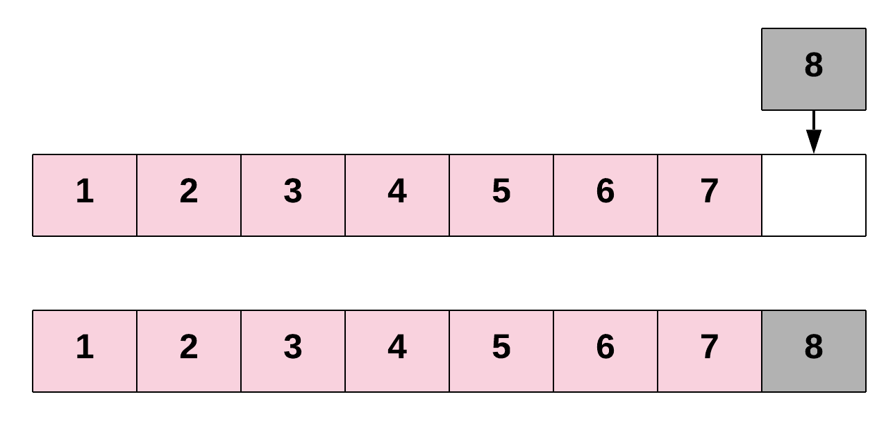
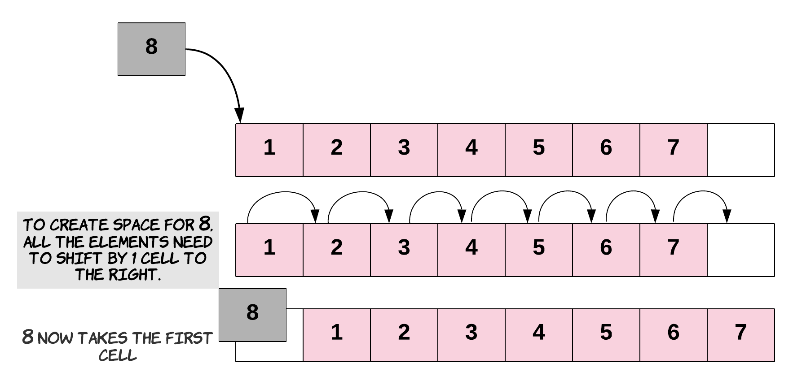
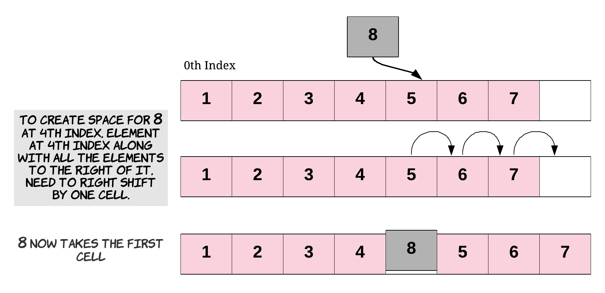

## Arrays

> An Array is a collection of items. The items could be integers, strings, DVDs, games, books—anything really. 
> The items are stored in neighboring (contiguous) memory locations. Because they're stored together, checking through 
> the entire collection of items is straightforward.

<h3>Accessing Elements in Arrays</h3>

> The two most primitive Array operations are writing elements into them, and reading elements from them. 
> All other Array operations are built on top of these two primitive operations.

```java
public class Main {

    public static void main(String... args) {
        
        int[] numbers = new int[5];
        
        //writing to the array
        numbers[0] = 5;
 
        //overwrite value at address (or index)
        numbers[0] = 7;  

        //reading from the array
        int number = numbers[0];
        System.out.println(number);

        //writing to the array using loop
        for (int i = 0; i < numbers.length; i++) {
            numbers[i] = i + 5;
        }

        //reading from the array using loop
        for (int num : numbers) {
            System.out.println(num);
        }  
    }

}
```

<h3>Array Capacity vs Array Length</h3>

**Array Capacity**

When we create an array, we specify how many elements it can hold. This is the array's **capacity**.

The array's capacity must be decided when the array is created. *The capacity cannot be changed later*.

The capacity of an array in `Java` can be checked by looking at the value of its `length` attribute.

```java
public class Main {

    public static void main(String... args) {
        int[] numbers = new int[5]; //5 is the capacity of the array.
        System.out.println(numbers.length); //will return the array capacity.
    }
}
```

**Array Length**

The array length is the number of elements currently present in the array. This is something that we 
need to keep track of.

```java
public class Main {

    public static void main(String... args) {
        int[] numbers = new int[5];
        numbers[0] = 1; //array length is 1.
        numbers[3] = 4; //array length is 2.
    }
}
```

<h3>Array Insertions</h3>

Inserting a new element into an Array can take many forms:

- Inserting a new element at the end of the Array.
- Inserting a new element at the beginning of the Array.
- Inserting a new element at any given index inside the Array.

**Inserting at the End of an Array**



**Inserting at the Start of an Array**

To insert an element at the start of an Array, we'll need to shift all other elements in the Array to the right by one index 
to create space for the new element. This is a very costly operation, since each of the existing elements has to be shifted 
one step to the right. The need to shift everything implies that this is not a constant time operation. In fact, the time taken 
for insertion at the beginning of an Array will be proportional to the length of the Array. In terms of time complexity analysis, 
this is a linear time complexity: `O(N)`, where `N` is the length of the Array.



**Inserting Anywhere in the Array**

Similarly, for inserting at any given index, we first need to shift all the elements from that index onwards one position to the right. 
Once the space is created for the new element, we proceed with the insertion. If we think about it, insertion at the beginning is basically 
a special case of inserting an element at a given index-in that case, the given index was `0`.

