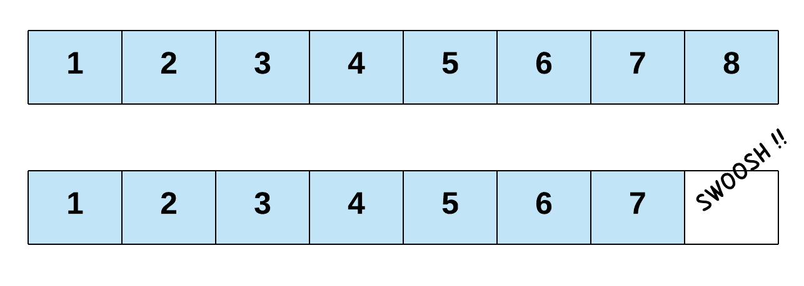
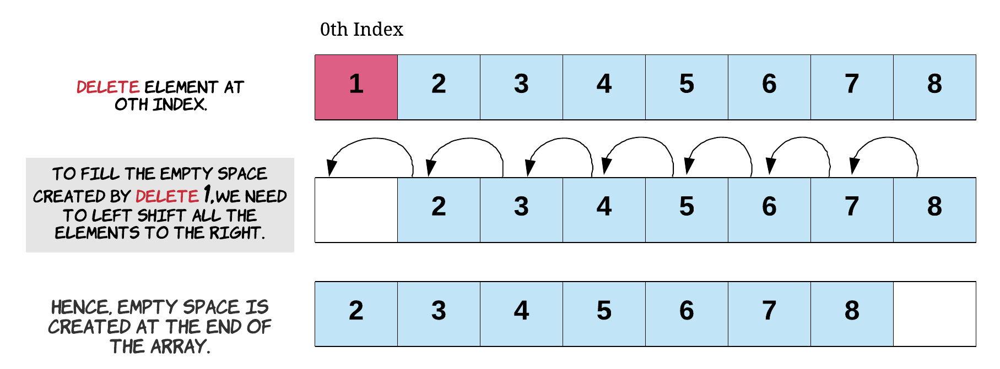
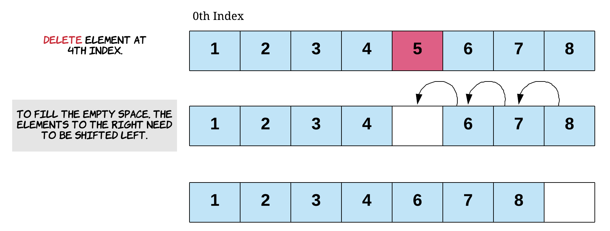
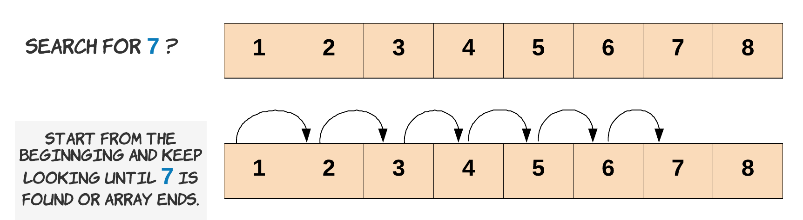
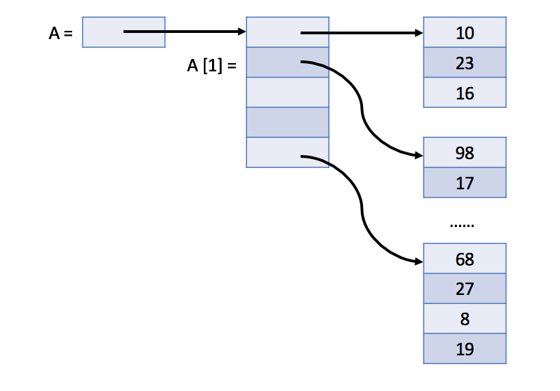

## Arrays

> An Array is a collection of items. The items could be integers, strings, DVDs, games, books-anything really. 
> The items are stored in neighboring (contiguous) memory locations. Because they're stored together, checking through 
> the entire collection of items is straightforward.

<h3>Accessing Elements in Arrays</h3>

> The two most primitive Array operations are writing elements into them, and reading elements from them. 
> All other Array operations are built on top of these two primitive operations.

```java
public class Main {

    public static void main(String... args) {
        
        int[] numbers = new int[5];
        
        //writing to the array
        numbers[0] = 5;
 
        //overwrite value at address (or index)
        numbers[0] = 7;  

        //reading from the array
        int number = numbers[0];
        System.out.println(number);

        //writing to the array using loop
        for (int i = 0; i < numbers.length; i++) {
            numbers[i] = i + 5;
        }

        //reading from the array using loop
        for (int num : numbers) {
            System.out.println(num);
        }  
    }

}
```

<h3>Array Capacity vs Array Length</h3>

**Array Capacity**

When we create an array, we specify how many elements it can hold. This is the array's **capacity**.

The array's capacity must be decided when the array is created. *The capacity cannot be changed later*.

The capacity of an array in `Java` can be checked by looking at the value of its `length` attribute.

```java
public class Main {

    public static void main(String... args) {
        int[] numbers = new int[5]; //5 is the capacity of the array.
        System.out.println(numbers.length); //will return the array capacity.
    }
}
```

**Array Length**

The array length is the number of elements currently present in the array. This is something that we 
need to keep track of.

```java
public class Main {

    public static void main(String... args) {
        int[] numbers = new int[5];
        numbers[0] = 1; //array length is 1.
        numbers[3] = 4; //array length is 2.
    }
}
```

<h3>Array Insertions</h3>

Inserting a new element into an Array can take many forms:

- Inserting a new element at the end of the Array.
- Inserting a new element at the beginning of the Array.
- Inserting a new element at any given index inside the Array.

**Inserting at the End of an Array**


**Inserting at the Start of an Array**

To insert an element at the start of an Array, we'll need to shift all other elements in the Array to the right by one index 
to create space for the new element. This is a very costly operation, since each of the existing elements has to be shifted 
one step to the right. The need to shift everything implies that this is not a constant time operation. In fact, the time taken 
for insertion at the beginning of an Array will be proportional to the length of the Array. In terms of time complexity analysis, 
this is a linear time complexity: `O(N)`, where `N` is the length of the Array.


**Inserting Anywhere in the Array**

Similarly, for inserting at any given index, we first need to shift all the elements from that index onwards one position to the right. 
Once the space is created for the new element, we proceed with the insertion. If we think about it, insertion at the beginning is basically 
a special case of inserting an element at a given index-in that case, the given index was `0`.


<h3>Array Deletions</h3>

Deletion in an Array works in a very similar manner to insertion, and has the same three different cases:

- Deleting the last element of the Array.
- Deleting the first element of the Array.
- Deletion at any given index.

**Deleting From the End of an Array**

Deleting from the end of an Array is the least time consuming of the three cases. Insertion at the end of an Array was also 
the least time-consuming case for insertion.

*Reminder*: `length` is the number of elements currently present in the array.

```java
public class Main {

    public static void main(String... args) {
        
        int[] arr = new int[10]; //declare array with capacity of 10 elements.

        int length = 0; //the array currently contains 0 elements.

        //add elements at the first 6 indexes of the array
        for (int i = 0; i < 6; i++) {
            arr[length] = i;
            length++;
        }
    }

}
```

The `length` variable in the above code keeps track of the next index that is free for inserting a new element. This is always 
the same value as the overall length of the Array. When we add elements to the Array, we also increment the `length` variable.

```java
//Deletion from the end is as simple as reducing the length of the array by 1.
length--;
``` 

Even though we call it a deletion, its not like we actually freed up the space for a new element. This is because we don't actually need 
to free up any space. Simply overwriting the value at a certain index deletes the element at that index. Seeing as the length variable 
in our examples tells us the next index where we can insert a new element, reducing it by one ensures the next new element is written over the deleted one. 
This also indicates that the Array now contains one less element, which is exactly what we want programmatically.



**Deleting From the Start of an Array**

Deletion from the start of the Array is the costliest of all deletion operations for an Array. If we want to delete the first element of the Array, 
that will create a vacant spot at the `0th` index. To fill that spot, we will shift the element at index 1 one step to the left. Going by the ripple effect, 
every element all the way to the last one will be shifted one place to the left. This shift of elements takes `O(N)` time, where `N` is the number of elements in the Array.



```java
public class Main {

    public static void main(String... args) {
        
        //Starting at index 1, we shift each element one position to the left.
        for (int i = 1; i < length; i++) {
            //Shift each element one position to the left.
            int_array[i - 1] = int_array[i];
        }
        
        /**
         * NOTE: It's important to reduce the length of the array by 1. Otherwise, we'll lose consistency of the size. 
         * This length variable is the only thing controlling where new elements might get added.
         */
        length--;
    }

}
``` 

**Deleting From Anywhere in the Array**

For deletion at any given index, the empty space created by the deleted item will need to be filled. Each of the elements to the *right* of the index we're deleting at will get shifted to the *left* by one. 
Deleting the first element of an Array is a special case of deletion at a given index, where the index is `0`. 
This shift of elements takes `O(K)` time where `K` is the number of elements to the right of the given index. Since potentially `K = N`, we say that the time complexity of this operation is also `O(N)`.



```java
public class Main {

    public static void main(String... args) {
        
        //Say we want to delete the element at index 1
        for (int i = 2; i < length; i++) {
            //Shift each element one position to the left
            int_array[i - 1] = int_array[i];
        }
        
        //Again, the length needs to be consistent with the current state of the array.
        length--;
    }

}
``` 

<h3>Search in an Array</h3>

Searching means to find an occurrence of a particular element in the Array and return its position. We might need to search 
an Array to find out whether or not an element is present in the Array. We might also want to search an Array that is arranged 
in a specific fashion to determine which index to insert a new element at.

If we know the index in the Array that *may* contain the element we're looking for, then the search becomes a constant time operation-we 
simply go to the given index and check whether or not the element is there.

**Linear Search**

If the index is not known, which is the case most of the time, then we can check every element in the Array. We continue checking 
elements until we find the element we're looking for, or we reach the end of the Array. In the worst case, a linear search ends up checking 
the entire Array. Therefore, the time complexity for a linear search is `O(N)`.



**Binary Search**

If the elements in the Array are in *sorted order*, then we can use binary search. Binary search is where we repeatedly look 
at the middle element in the Array, and determine whether the element we're looking for must be to the left, or to the right. 
Each time we do this, we're able to halve the number of elements we still need to search, making binary search a lot faster than linear search!

The downside of binary search though is that it only works if the data is sorted. If we only need to perform a single search, 
then it's faster to just do a linear search, as it takes longer to sort than to linear search. If we're going to be performing a lot of searches, 
it is often worth sorting the data first so that we can use binary search for the repeated searches.

<h3>In-Place Array Operations</h3>

**In-place** array algorithms operate on the given array to achieve the expected output and don't require extra memory space.

An important difference for *in-place* vs *not in-place* is that in-place modifies the input Array. This means that other functions 
can no longer access the original data, because it has been overwritten.

<h3>2D Arrays</h3>

Similar to a one-dimensional array, a two-dimensional array also consists of a sequence of elements. But the elements can be laid 
out in a `rectangular grid` rather than a line.

```java
public class Main {

    public static void main(String... args) {

        int[][] a = new int[2][5];
        printArray(a);

        int[][] b = new int[2][];
        b[0] = new int[3];
        b[1] = new int[5];
        printArray(b);
    }

    private static void printArray(int[][] arr) {

        for (int i = 0; i < a.length; ++i) {
            System.out.println(a[i]);
        }
        for (int i = 0; i < a.length; ++i) {
            for (int j = 0; a[i] != null && j < a[i].length; ++j) {
                System.out.print(a[i][j] + " ");
            }
            System.out.println();
        }
    }

}
```

In `Java`, the two-dimensional array is actually a one-dimensional array which contains `M` elements, each of which is an array of `N` integers.

