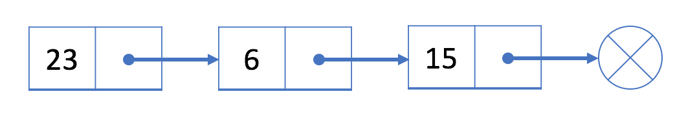

## Lists

```java
import java.util.ArrayList;
import java.util.Arrays;
import java.util.Collections;

public class Main {

    public static void main(String... args) {

        List<Integer> v1 = new ArrayList<>(); //initialize list
        List<Integer> v2; //v2 == null

        //Cast array to a list
        int[] a = new int[]{1, 2, 3, 4, 5};
        v2 = new ArrayList<>(Arrays.asList(a));

        //Make copy
        List<Integer> v3 = v2; //another reference to v2
        List<Integer> v4 = new ArrayList<>(v2); //make actual copy of v2

        //Sort
        Collections.sort(v2);

        //Add new elements
        v2.add(6);
        v2.add(7);

        //Modify list
        v2.set(0, 3); //change value at first index.

        //Delete element
        v2.remove(v2.size() - 1); //delete element at last index.

    }

}
```

<h3>Linked List</h3>

Similar to the array, the linked list is also a `linear` data structure. Here is an example:



Each element in the linked list is actually a separate object while all the objects are **linked together by the reference field** in each element.

There are two types of linked list: **singly linked list** and **doubly linked list**. The example above is a singly linked list and here is an example of doubly linked list:


<h5>Singly Linked List<h5>

Each node in a singly-linked list contains not only the value but also **a reference field** to link to the next node. By this way, the singly-linked list organizes all the nodes in a sequence.

```java
public class SinglyListNode {
    int val;
    SinglyListNode next;
    SinglyListNode(int x) { val = x; }
}
```

In most cases, we will use the `head` node (the first node) to represent the whole list.

**Operations**

Unlike the array, we are not able to access a random element in a singly-linked list in constant time. If we want to get the i<sup>th</sup> element, 
we have to traverse from the head node one by one. It takes us `O(N)` time on average to `visit an element by index`, where `N` is the length of the linked list.